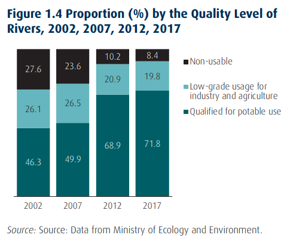

# Background

This section provides the background knowledge and literature review relevant to this thesis. First, literature of global and Chinese water resource trends and implications are presented. Then, the case is made for holistic water resource management in China. Later, research into education, knowledge and perception of the environment broadly and water quality is presented. Finally, the lack of research linking theses themes together, and the utility of this thesis, is justified.

## Water Resource Management — Trends and Implications

Water scarcity is a worldwide phenomenon with particular importance to China. @mekonnenFourBillionPeople2016 analyzed the current situation of water scarcity worldwide and found “two-thirds of the global population (4.0 billion people) live under conditions of severe water scarcity at least 1 month of the year,” with nearly half living in China and India alone.

Despite the governments past and current efforts, further action is required. @liuWaterSustainabilityChina2012 look at water sustainability in China. They conclude that while China’s recent policy efforts to alleviate water scarcity have been laudable, they are insufficient. They are also inefficient, especially with regards to engineering and infrastructural approaches. @luWaterInfrastructureChina2014 looks at the importance of full project life-cycle cost analysis in addressing water challenges, particularly with wastewater treatment facilities, concluding that there are serious inefficiencies currently. @webberSouthNorthWater2017 look at the infrastructure side of water resource management in China with a review of the South-North Water Transfer Project, and find that this project is emblematic of the engineering-heavy approach often taken in China and will pose serious risks to regional governance and have serious environmental impacts.

The literature supports the increased study and implementation of multidisciplinary water resource management policy. @baiSustainableUrbanWater2001 look at sustainable urban water resource management with a case study analysis of Tianjin, China. They suggest that a holistic, systems approach to water management is key for sustainability. @araralWaterGovernanceReview2013 look at water governance, water insecurity, and its related research. They find that a second-generation research agenda on water governance, including a focus on incentive structures and other multi-disciplinary approaches, is required. Not all management should be on the supply side, at least in regards to aleviating water scarcity. [@wangWaterResourcesManagement2012] looks at the relationship between water resource management and droughts in China and find that demand-side management can be more effective in meeting the challenges imposed by increasingly-severe droughts. Multiple approaches should be taken in unison. @hofstedtChinaWaterScarcity2010 looks at the implications of domestic and international stability stemming from China’s water scarcity and the government’s current plans to address it. They argue that many of the options to alleviate water scarcity (increase water pricing, remove the requirement to be self-sufficient in grain production, increased efficiency of water usage in agriculture) all have serious downsides, and can have serious negative effects on political
stability domestically and internationally.

Finally, @wardDatarichInformationpoorSyndrome1986 looks at water quality monitoring and improvements (at the time) in
data collection. They argue that increased data collection itself is not enough to affect the management of water resources; data analysis and reporting are also very important, and that understanding why monitoring water quality is important in the design process of water quality monitoring itself.

## Environmental Knowledge and Perception

Water quality and quantity issues in China and abroad sit within the context of environmental policy, environmental education, and societies' perception of the two. [@caldwell1990international] Analysis linking environmental knowledge and attitudes (perception) have existed for decades. The assumption, and common model, is that:

> "increased knowledge leads to favorable attitudes towards pollution abatement which in turn lead to an action promoting environmental quality." [@ramseyEnvironmentalKnowledgeAttitudes1976]

At the time, in the 1970s, most scholars agreed with this model, concluding that "a broad public literacy of biological and ecological concepts is at the heart of defining, reclaiming, and maintaining environmental quality," but also concedes that the results of education are variable. [@ramseyEnvironmentalKnowledgeAttitudes1976] 

Understanding the background of environmental policy, knowledge, education and perception is important in understanding how they interact in the concept of water quality in China and abroad.

### Definitions

Several definitions are adapted for this thesis, and are discussed in more detail in following sections. This is important since many terms are used interchangably in the field of environmental issues and how humans interact and perceive them. [@johnsonMeaningsEnvironmentalTerms1997] The first two are defined by [@sudarmadiSurveyPerceptionKnowledge2001]. *Environmental awareness* is "the attention and concern (mindful and heedful) of individuals to environment problems." *Environmental perception* is "the recognition of \[an environmental issue]\ as a problem, based on memory and prior experience." These two interact, as perception is "a basic determinant of awareness in that it triggers attention and concern." [@endsleyTheorySituationAwareness1995] However, "perception only leads to awareness when it exceeds frequency and intensity thresholds. [@meriklePerceptionAwarenessPerspectives2001] In the context of environmental issues, perception refers to the state of the environment (or a specific environmental feature) as being problematic, while awareness refers to attention to the issue because of the impacts of a change in usability of the environment. [@tangEstimationAwarenessPerception2013, sec. 2.1.2]

Thus, this definition of environmental perception is applied to water quality perception: *water quality perception* is the recognition of water quality as a problem. When reference is made to an increase in perception, it is referring to an increased intensity of the recognition that water quality issues are a problem. Further definitions and applications are made in following sections.

*Environmental knowledge* is as it sounds – the amount that someone knows about the environment or environmental issues. It has long been assumed that an increase in environmental knowledge can lead to changes in attitude and behavior, which in turn can influence policy. [@arcuryEnvironmentalAttitudeEnvironmental1990] Thus, for this thesis, a similarly clear definition is applied for water quality: *knowledge of water quality* refers to the acquisition of a baseline amount of knowledge about water quality. Further definitions and applications are made in following sections.

Finally, *environmental quality* refers to measurement of the condition or state of the environment, based off of predetermined variables, indicators, and methodology. [@johnsonMeaningsEnvironmentalTerms1997] The authors stress that this term is irrespective of the source and cause of the condition, only that the state is compared against and relative to certain requirements and standards. For example, changes in water quality can be caused by both human-induced pollution and by naturally-occurring changes. Thus, applied to the context of water quality, the definition emerges: *water quality* "is a measure of the condition of water relative to" standards and requirements of humans. [@johnsonMeaningsEnvironmentalTerms1997, p. 587]

<!-- 

### Environmental Policy

Environmental conservation has a long and global history, at times being documented as early as the seventh century, with examples afterwards often being local or anecdotal. [@StCuthbertFather2013] In the broader context of environmental appreciation or dependency, the history likely goes back to the dawn of humanity. This is evident in written and modern-day history as some indigenous cultures do not separate the environment and the society. [@armieroHistoryEnvironmentalismLocal2014, p. 2-3]

Much of the documented history of modern environmentalism and environmental policy comes from the United States. Preservation was one of the first policy instruments, most notably with the Yellowstone National Park Act of 1972 [@RulesRegulationsYellowstone1881] Water pollution was one of the first environmental issues which received federal legislation with the The Federal Water Pollution Control Act of 1948 [@ModernEnvironmentalMovement], which later became known as the Clean Water Act. [@usepaHistoryCleanWater2013]

Another related field of study is Environmental history, which "studies the mutual relationships of humans and nature through time." [@hughesWhatEnvironmentalHistory2016, p. 1] This field of study, a subset of the field of history, aims to link and remind historical significance of the link between humans and nature. Environmental historians aim to "see human events within the context where they happen, and that is the entire natural environment." [@hughesWhatEnvironmentalHistory2016, p. 2] This has relevance to policy makers worldwide and in China.

Despite much of the literature covering history in the United States, environmental protection can be seen as a global phenomenon in many parts of the world and throughout the 20th and 21st centuries, albeit with differing impact, scope and timeliness. The link to its global nature is highlighted in a study which finds that international organizations and communities have central importance in the diffusion of one particular type of environmental policy, the Environmental Impact Assessment, and its particular importance for less-developed countries. [@hironakaGlobalizationEnvironmentalProtection2002] 

-->

### Environmental Aspects in China

Despite its international perception (often correct) of poor environmental protection, China does have history of concern with environmental degradation. In terms of history, the consensus in China amongst researchers is that while the field of environmental history originated in the United States in the early 1970s, the field came to China in the 1990s, and is now studied by researchers of historical geography, social, economic and world history. [@hanHistoricalGeographyEnvironmental2016] While a new and evolving field, the trajectory of study in this area comes from pollution issues in China, which follows trends from the emergence of this study in other countries. [@hanHistoricalGeographyEnvironmental2016, p. 7] China makes "great leaps" of progress and reform every decade or so since the political reform in the early 1970s. [@xieChinaHistoricalEvolution2020] #check-source 

There is also evidence showing that environmental issues and their repercussions are deemed important by the local population. One study found that Chinese university students were more concerned about environmental risk, and deemed "environmental issues to be more harmful to health, to the environment, and to social economic development of the nation than did the American respondents.environmental issues to be more harmful to health, to the environment, and to social economic development of the nation than did the American respondents." [@duanCrossCulturalStudyEnvironmental2012] Furthermore, they found that Chinese students were concerned about fresh water shortage, and safe drinking water shortage more than other environmental concerns, and only less so than human population growth.

Finally, simple analysis of China's one-party political implementation might lead one to assume that civil society has little to no influence on environmental policy. However, this does not appear to be the case. One study found that Chinese civil society organizations (CSOs) work in similar ways to those in more liberal and democratic countries. [@teetsPowerPolicyNetworks2018] This further places importance water quality knowledge and environmental education, since there are direct and indirect links to policy changes.

### Environmental Knowledge and Education

Knowledge about most topics is learned through theory (education) and practice (experience). #cite This is no different with the environment. #cite The term 'Environmental Knowledge' accounts for multiple ways of learning and acquisition. In the 1970s, authors stressed the complicated pathways from information to knowledge:

> "...the acquisition of environmental knowledge involves a complicated series of processes – sensation, perception, imagery, retention, recall, reasoning, problem solving, judgment, and evaluation. It is an individual process, each person having a unique cognition of the world, but the overlap in images among individuals permits environmental communication." [@holcombReviewEnvironmentalKnowing1977]

Environmental Education (EE) is a subset of Environmental Knowledge and is inexorably tied to environmental protection and policy One of its main goals is "Awareness - to help social groups and individuals acquire an awareness and sensitivity to the total environment and its allied problems." [@IntergovernmentalConferenceEnvironmental] An earlier definition was presented in 1969 from the United States, and has proved reliable and accurate since:

> **Environmental education** is aimed at producing a citizenry that is **knowledgeable** concerning the biophysical environment and its associated problems, aware of **how** to help solve these problems, and **motivated** to work towards their solution. [@stapp1969concept]

While there is a longer document environmental protection movement in the United States than in China, it is important to note that Dr. Stapp wrote this definition with the perspective that only 50 years had passed since much of the United States was rural and underdeveloped. It can be argued that China shares this temporal perspective today.

Progress continued with development and deployment of EE the international level, with many landmark events in environmentalism and sustainability putting EE at their core, including The International Environmental Education Program (IEEP 1975), the World Conservation Strategy (IUCN 1980), 'Tbilisi Plus Ten' (1987), Our Common Future (WCED 1987), and The Earth Summit (UNCED). [@nealHandbookEnvironmentalEducation2003, p13-15]

EE also has the potential for direct and indirect positive environmental impacts. One study reviewed 105 EE studies which emphasized conservation outcomes, and found that EE programs which included and focused on ecological indicators (such as improved water quality) had outcomes with the most directness (as opposed to indirect impact categories such as community capacity building), and concluded that local aspects of regional and global problems are important for the directness of the link. [@ardoinEnvironmentalEducationOutcomes2020]

Several other studies have mixed results. One study examined the relationship between environmental knowledge and attitudes of fourth-graders in Germany but found no correlation between the two. [@lieflanderEducationalImpactRelationship2018] However, the authors noted that the lack of correlation was probably caused by measurement constraints. Another study examined high school students' environmental knowledge and attitudes and found "significant difference in both knowledge gain and attitudes of students after exposure" where "environmental knowledge scores increased by 22%" after the completion of a 10-day environmental course, and "environmental attitudes became more environmentally favorable." [@bradleyRelationshipEnvironmentalKnowledge1999]

### Environmental Perception

There is an intuitive link between the state of the environment and one's perception of the environment. Environmental perception has been defined as "awareness of, or feelings about, the environment, and as the act of apprehending the environment by the senses." [@zubeEnvironmentalPerception1999] A more detailed definition takes into account its multi-dimensional aspects, as a "transactional process between the person and the environment." [@ittelsonEnvironmentCognition1973] He offered three general conclusions: 

> 1. It is not directly controlled by the stimulus.
    2. It is linked to and indistinguishable from other aspects of psychological functioning.
    3. It is relevant and appropriate to specific environmental contexts.

Ittelson continues in his theoretical framework and suggest that environments "surround the person, provide opportunities for exploration, and provide information that is received through all senses – feeling, hearing, seeing, smelling, and tasting." [@zubeEnvironmentalPerception1999, section. Definition] Environments provide more information than the person can apprehend, thus leaving the potential for the environment to influence in unperceivable ways. Additionally, according to Ittleson, environments have ambiance - a "quality, mood or atmosphere" which can relate to the social context of environmental experience, and is viewed through the lens of past experience and current perceptions. Simply put, environments affect both individuals and societal groups in ways which are not always easy to understand, and can change or be affected in the present and the past. This has an affect on policy, as information regarding how the general population feels about the environment can inform policy makers.

While studies into societies' perception of the environment often focuses on positive aspects when investigating wilderness and landscape aesthetics, studies regarding air, water and sound usually focus on negative factors. [@zubeEnvironmentalPerception1999, section. Air, water, and sound] These studies often focus on maximum levels of pollutants (quantitatively or qualitatively) or annoyance thresholds. Interestingly, different cultures have been found to have different threshold qualitative pollution or annoyance levels, which could be seen as a limitation of this study.

One other factor in environmental perception was the "magnitude, diversity and rapidity of environmental change." [@zubeEnvironmentalPerception1999, section. Major environmental changes] Studies in this domain indicate that "physical proximity to the change, magnitude and kind of change, length of time in current residence, and personal value orientations are all related to the perception of and response to the phenomenon." [@zubeEnvironmentalPerception1999, section. Major environmental changes] 

### Linking Knowledge and Perception

Studies have looked at some of the variables mentioned previously in relation to other demographic data. One study in 1998 "investigated differences in perception, knowledge, awareness and attitude with regard to environmental problems between educated and \[non-educated]\ groups." [@sudarmadiSurveyPerceptionKnowledge2001] They found that "subjects in the educated group had better perception, more detailed knowledge, were more aware, and had better attitudes in regard to regional and global environmental problems."

## Water Quality and Perception

### Components of Water Quality

The WHO sets standards for drinking water quality [@worldhealthorganizationGuidelinesDrinkingwaterQuality2017] , which have been applied by the Chinese government. [@quChinaNewNational2012; @zhonghuarenmingongheguoguojiaShengHuoYinYongShuiWeiShengBiaoZhun2006] China applied 106 factors into its drinking water quality standards in 2011, mostly in line with the WHO's 155 factors from the same year. These are broken down into several categories, including microbial aspects, chemical aspects, radiological aspects, and acceptability aspects. For this thesis, the exact determinate of these components are not investigated, nor are the relative importance between certain indicators and perception, or knowledge. However, it should be noted that not all indicators of water quality have direct negative health implications – for the acceptability aspects (also referred to as aesthetic aspects), undesirable qualities (including taste, smell, and color) can erode public trust in otherwise healthy drinking water. [@worldhealthorganizationGuidelinesDrinkingwaterQuality2017, p. 219]

### Water Quality in China

China often cites its developing country status as a reason that it under-performs on environmental indicators. #cite However, China ranks lower than other countries with similar or even lower GDP. [@wendlingz.a.2020EnvironmentalPerformance2020, p. X, fig. ES-1] Overall, China ranked 120th with a score of 37.3 in 2020, which was the same ranking as in 2018 but with a decreased score from 50.74.[^1] [@wendlingz.a.2020EnvironmentalPerformance2020 p. XII; @wendling2018EnvironmentalPerformance2018 p.15] 

In 2020, China ranked 54th (6th regionally) in sanitation and drinking water, with a score of 59.4/100. [@wendlingz.a.2020EnvironmentalPerformance2020, p. 57] Specific rankings for sanitation and drinking water were not available for 2018. For the broader category of Environmental Health (HLT), China scored 31.72/100. [@huangEnvironmentalPerformanceAsia2019]

China uses a tiered categorical composite indicator, referred to as China's Water Quality Index (CWQI). [@NationalStandardsPeople]

| Class | Utilization                                                                                                                                                                        |
|------:|------------------------------------------------------------------------------------------------------------------------------------------------------------------------------------|
|     I | Mainly applicable to the water from sources, and the national nature reserves.                                                                                                     |
|    II | Mainly applicable to first class of protected areas for centralized sources of drinking water, the protected areas for rare fishes, and the spawning fields of fishes and shrimps. |
|   III | Mainly applicable to second class of protected areas for centralized sources of drinking water, protected areas for the common fishes and swimming areas.                          |
|    IV | Mainly applicable to the water areas for industrial use and entertainment which is not directly touched by human bodies.                                                           |
|     V | Mainly applicable to the water bodies for agricultural use and landscape requirement.                                                                                              |

While the state is improving, there is still progress to be made: #todo **turn into my own graphic.** [@theworldbankWatershedNewEra2019, fig. 1.3; p. 19]

Access to water is another factor in the population's perception of water. China has increased its use of basic sanitation services by 28% from 2000-2017 [@jmpworld2019progress, p. 31, fig. 33] and achieved 100% safely managed drinking water access. [@jmpworld2019progress, p. 48, fig. 51] #check-source

{table} Minimum water access in China in 2000 and 2017 
:name: jmp-2019-china-water-access

| Year | Population | % Urban | At least basic - National | At least basic - Rural | At least basic - Urban |
|:----:|:----------:|:-------:|:-------------------------:|:----------------------:|:----------------------:|
| 2000 | 1 283      | 36      | 80                        | 70                     | 98                     |
| 2017 | 1 489      | 58      | 93                        | 86                     | 98                     |

[@jmpworld2019progress, p. 89, annex. 3.1]

{table} Minimum national improved water details in China in 2000 and 2017 
:name: jmp-2019-china-water-detail-national

| Year | Safely Managed | Accessible on premises | Available when needed | Free from contamination | Piped | Non-piped |
|:----:|:--------------:|:----------------------:|:---------------------:|:-----------------------:|:-----:|:---------:|
| 2000 | -              | 65                     | 77                    | -                       | 51    | 30        |
| 2017 | -              | 92                     | 90                    | -                       | 76    | 18        |

[@jmpworld2019progress, p. 89, annex. 3.1]

{table} Minimum rural water details in China in 2000 and 2017 
:name: jmp-2019-china-water-detail-rural

| Year | Safely Managed | Accessible on premises | Available when needed | Free from contamination | Piped | Non-piped |
|:----:|:--------------:|:----------------------:|:---------------------:|:-----------------------:|:-----:|:---------:|
| 2000 | -              | 46                     | 65                    | -                       | 31    | 40        |
| 2017 | -              | 86                     | 81                    | -                       | 54    | 34        |

[@jmpworld2019progress, p. 89, annex. 3.1]

{table} Minimum urban water details in China in 2000 and 2017 
:name: jmp-2019-china-water-detail-urban

| Year | Safely Managed | Accessible on premises | Available when needed | Free from contamination | Piped | Non-piped |
|------|----------------|------------------------|-----------------------|-------------------------|-------|-----------|
| 2000 | 93             | 98                     | 97                    | 93                      | 87    | 12        |
| 2017 | 92             | 96                     | 96                    | 92                      | 92    | 6         |

[@jmpworld2019progress, p. 89, annex. 3.1]

China's improvement in water infrastructure has gone on for decades, with particular improvement since 1990 with an increases in municipal water supply utilities coverage from 50% in 1990 to 88% in 2005. [@browderSteppingImprovingPerformance2007, xvii] In the same report on infrastructural improvements, the authors repeatedly cite concerns for water quality and quantity issues, citing the problem originating from "outdated water treatment technology and high levels of pollution in the raw water." [@browderSteppingImprovingPerformance2007, p. 17] The report also states that "Water quality monitoring is generally poor and the data is consequently unreliable," however this is outdated. [@browderSteppingImprovingPerformance2007, 17] The report continues that national policies, including drinking water quality, are only implemented in higher-tier cities and are often loosely enforced. [@browderSteppingImprovingPerformance2007, p. 30] The problem was especially evident in second tier, third tier and non-urban towns, as evident below:

{table} Urban Water Market Segments 
:name: wb-2005-urban-water

| Market Segment                         | Number of Cities | Total Population (million) | Per Capita GDP (RMB) | Average Wastewater Treatment Coverage (%) | Average Water Supply Coverage (%) |
|----------------------------------------|------------------|----------------------------|----------------------|-------------------------------------------|-----------------------------------|
| Pop > 2m, GDP/cap > $3k                | 21               | 90                         | 35,900               | 61                                        | 93                                |
| 0.5m < Pop < 2m, $1.5k < GDP/cap < $3k | 331              | 201                        | 19,100               | 38                                        | 91                                |
| Pop <0.5m, GDP/cap < $1.5k             | 310              | 58                         | 7,300                | 21                                        | 86                                |
| Country Towns                          | 1,636            | 96                         | N/A                  | 11                                        | 82                                |

[@browderSteppingImprovingPerformance2007, p. 31, tab. 3.1]

The report continues, noting a slight increase in average category V or V+ in Chinese rivers from 1991 - 2002. [@browderSteppingImprovingPerformance2007, p. 33, fig. 3.3] It also notes discrepancies between water supply, water quality and public information for residents to judge the quality themselves (i.e. perception), noting that most urban residents do not drink water directly and is first boiled, which is both a cultural tradition and response to "the uncertain quality of the water from the tap." [@browderSteppingImprovingPerformance2007, p. 61]

China's water quality faces continued scrutiny in the 2010s. In 2011, as a part of the 12th Five Year Plan (2011-2015), China's central government earmarked almost RMB 700b (roughly US$108b) for water improvement, including water treatment and piping systems. [@hongqiaoliuChinaLongMarch2015, section. Intro] Within this timeline, China's 'National Drinking Water Quality Standard’ (GB 5749-2006)' was aimed to be implemented.[^3] [@zhonghuarenmingongheguoguojiaShengHuoYinYongShuiWeiShengBiaoZhun2006] While improvements have been made in access to water, the quality of the water is questionable. China has historically been reluctant to release such data - the mid-2013 water quality assessment report was "classified" as of 2015 [@hongqiaoliuChinaLongMarch2015, p. 4], and the state of china's soil pollution was classified as a "state secret" until 2014. [@hornbyChinaAdmitsWidespread2014] Greenpeace East Asia determined that "Fourteen provinces failed to meet their water quality improvement targets during the 12th Five-Year Plan period (2011-2015)." [@NearlyHalfChinese2017] The analysis noted that national progress was made during the first half of the 12th Five-Year Plan period, but 'flattened off' beginning in 2013.

### Water Quality Perception

While actual water quality is clearly important, so too is perception. Many factors exist in the public's perception of water quality. While "organoleptic properties" exist, most notably flavor, others exist including "risk perception, attitudes towards water chemicals, contextual cues provided by the supply system, familiarity with specific water properties, trust in suppliers, past problems attributed to water quality and information provided by the mass media and interpersonal sources." [@migueldefrancadoriaFactorsInfluencingPublic2010] Water quality perceptions are especially important when water is used for drinking or other domestic purposes, causing some to consider perceptions of water quality more important than actual water quality. [@sheat1992public] Thus, it is important for policy makers to consider not only reality of water quality, but also the public's perception. Trends indicate that water quality policy should include not only the protection of human health, but also "acceptability." [@BonnCharterSafe2004 §7.7]

Research into water quality perception has existed since the 1960s, but is very heterogeneous, including; different use cases of water (drinking, household, agricultural, etc.); different delivery methods (piped, bottled) and different geographic and demographic localities, with most research conducted on bottled water and in developed countries. [@migueldefrancadoriaFactorsInfluencingPublic2010]

One study represented research in an under-studied theme and demographic. Stakeholders' perceptions of important measures of river water quality in one region of Ghana suggest that in developing countries (or regions with lower objective water quality), faecal matter in and around rivers, and presence of plastic waste in rivers was deemed to be the most important measure, followed by the smell, clarity, color, and taste ("organoleptic properties") of the water. [@okumahWhatMattersMost2020, fig. 3]

Multiple factors drive perception of environmental issues. In a related issue, water scarcity, one study examined farmers' ($n = 446$) awareness and perception of water shortages in irrigation. [@tangEstimationAwarenessPerception2013] They found that "age, percentage of time spent on farming and social network are the main determinants of awareness," and that "water price and drought experience are the most important explanatory variables of perception" in the Guanzhong Plain, Shaanxi Province, China. Furthermore, they found that awareness and perception strongly interact, citing literature which found that households who used less water show a higher level of awareness of water conservation. [@gregoryRepeatedBehaviorEnvironmental2003] However, these study water quantity, not water quality, so they are not necessarily analogous.

## Linking Water Quality, Knowledge and Perception

While many studies have examined the issues discussed earlier, few have looked at the alignment of water quality perceptions and actual water quality. One such study was conducted in Newfoundland, Canada, which "investigated public perceptions of water quality and the perceived health risks and associated with the actual quality of public water supplies in the same communities." [@ochooAssociationPerceptionsPublic2017] While they found "no association with public satisfaction level and actual water quality of the respective communities," they did show demographic disparities in water quality perception.[^2] Furthermore, the authors found that differences in opinion existed between respondents who were supplied by the same water system. However, this is expected due to the problematic nature of public opinion. [@shepardPublicOpinion1909] The authors also mentioned that water quality data is publicly available, but is most likely not communicated in a way which facilitated knowledge transfer.

Another study investigated discrepancies in drinking water quality and behavior of household water treatment in Nepal. [@kunwarWaterQualityAvoidance2019] They found that perception and real drinking water quality influences behavior – a deviation between the two was determined to be a primary factor in using water treatment techniques, in addition to drinking water source, income, education, and taste.

An investigation into public perception, knowledge and behavior regarding river water quality was conducted in India [@tarannumUnderstandingPublicPerception2018] They found that respondents use mostly lived experience, and not scientific methods, to shape their perception of river water quality, while risk perception was directly linked to their utilization of the river in their daily lives.

## Background Conclusions

In conclusion of background terms, ideas and research, direct measurement of environmental quality is not the only variable in analyzing how the local population knows, perceives and interacts with their local and regional environment. As indicated, complicated education and knowledge pathways influence perception of water quality in addition to the standard hypothesis that direct water quality leads to perception. In order to mitigate the negative implications of water stress, a further analysis of how these terms interact is vital.

—

[^1]: The framework of the overall EPI score is comprehensive and weighs 32 indicators. However, the weighting of some indicators changed between 2018 and 2020, making comparison difficult. The visualization of each years breakdown can be seen in 2018 [@wendling2018EnvironmentalPerformance2018, p. 6, fig. 2.1] and 2020 [@wendlingz.a.2020EnvironmentalPerformance2020, p. XI, fig. ES-2].

[^2]:  The authors concluded that "Older, higher educated and high-income group respondents were more satisfied with water quality than the younger, less educated and low-income group respondents." However, they also stated that "We had little scope to explore the possible explanations, and hence further studies are required to verify the age, gender educational status and income differential about the satisfaction of public service like water supply."

[^3]: This standard was first introduced in 2007 in accordance to international water quality standards. However, since the water quality across China then was far below the new standard, it only went into full effect in July 2012.