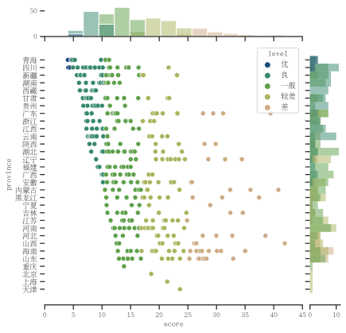

#  Methodology

## Data Sources
The main analysis of this thesis is centered around two data sets, which are described below.

### Chinese General Social Survey (CGSS)

This national survey, originally launched in 2003, aims to monitor and document relationships between quality of life (in both individual and collective scope) and social structures, both in urban and rural environments. {cite}`HomeZhongGuoZongHeSheHuiDiaoCha` One of the main benefits is its longitudinal design – however this feature is not utilized in this thesis due to data availability, which will be discussed later. The survey has been conducted nearly annually since 2003, with a major redesign conducted in 2010. Thus, surveys conducted prior to 2010 are referred to as *Cycle I* while surveys conducted in 2010 or later are referred to as *Cycle II*.

The CGSS is conducted by face-to-face interviews, which on average require 90 minutes to complete. {cite}`ImplementationZhongGuoZongHeSheHuiDiaoCha` The survey consists of a questionnaire, which is composed of three modules (beginning in Cycle II). The structure is referenced in **Table XX** in the Appendix. The published data is in the form of a Stata file, which consists of 11,783 rows (respondents) and 871 columns (variables).

The Environmental Module ("环境(ISSP)" or "L部分"[^2]) is of particular interest in this analysis. {cite}`DiaoChaWenJuanZhongGuoZongHeSheHuiDiaoCha` It asks 25 questions and sub-questions, most of which are directly or indirectly related to the environment. There are several interesting questions which ask things related to environmental protection, importance, perception and knowledge:

The primary question regarding water quality perception is question `l14d`, which asks about the severity of harm to the environment caused by pollution of rivers and lakes. [^2] Survey participants can respond with a range from one to five, with one being “extremely harmful to the environment,” to five being “there is no harm at all.”[^3] This question is significant because it quantifies the respondents’ perception of the severity of the negative impact of poor water quality on the environment. However, this question does not directly regard the perception of drinking water quality, nor to the importance of drinking water quality for health or other factors.

This question has several other limitations. Since it is about subjective perception of how water quality affects environmental quality, several scenarios can occur in which the response of this question does not necessarily directly equate to their perception of local water quality. For example, with water quality and environmental quality having the potential for alignment (i.e., good water quality and good environmental quality), divergence (i.e., poor water quality, but good environmental quality) or no perceived relation, there are five possibilities for how the respondent could justify their response. While this is of concern, the question still ensures that *water quality perception* is being asked of the respondent since the respondent must first consider that poor water quality does impact the environment. If the respondent replies that there is no impact, only this answer indicates the potential that the respondent does not consider water quality and environmental quality to be related.

The primary question regarding water quality knowledge was question `l2409` tests respondents' knowledge of the water quality scale used by China. The question requires respondents to state if a statement about water quality is correct, incorrect, or if they don't know. [^4] This question is important since it tests respondents' knowledge of the water quality scoring system used in China. However, this question does not directly test users knowledge of the underlying environmental and pollutant issues which are the basis of this water quality scale, nor does it test their knowledge or education about environmental issues or protection directly.

Many other interesting questions are present in the data set. For this thesis, several others were selected, and the values were analyzed. This discussion is presented later in this thesis.

### Blue City Water Quality Index Ranking (WQIR)
The second data set was compiled by the author from a report from the Institute of Public & Environmental Affairs, a non-profit environmental research organization based in Beijing. {cite}`IPE` The report, the *Blue City Water Quality Index 2019*, compiles various surface, drinking, and ground water quality data published by various government agencies and assigns a score (their proprietary *Blue City Water Quality Index Score (BCWQI)*) and publishes the results at a sub-provincial level (second administrative level, or “admin 2”). {cite}`jun2018BlueCity` The methodology and conversion to the government’s water quality score is provided. This report was chosen as the basis for this data set since it was the most comprehensive data the author could find with the closest publication date to the CGSS. The difference in time of the two data sets is discussed in the section. In the appendix of this report, the BCWQI for each second administrative level, including the city name, province, and ranking, is included.

It should also be noted that the water quality score used in the WQIR data set is derived from the official Chinese water quality index system. The following table translates between the two scoring systems. {cite}`jun2018BlueCity, p.5`

| IPE Score     | IPE Level (EN)          | IPE Level (ZH) | EQ  Water |
|:-------------:|:-----------------------:|:--------------:|:---------:|
| 0.00 - 4.79   | Excellent               | 优             | II     |
| 4.79 - 10.28  | Good                    | 良             |III    |
| 10.28 - 16.85 | Moderate                | 一般           | IV     |
| 16.85 - 24.74 | Relatively Poor         | 较差           | V       |
| 24.70 - 50.00 | Poor                    | 差             | V      |

## Data Processing and Evaluation
Analysis for this thesis was conducted using the general-purpose computer programming language Python. To allow for accessibility, readability, and reproducibility, the primary data analysis medium was a Jupyter notebook {cite}`kluyverJupyterNotebooksPublishing`, a document format which allows for text and code to be read and execute in an easy-to-read format, which was hosted on GitHub, to allow for accessibility. {cite}`rynearsonWrynearsonChinawater2020` This was chosen after initial data analysis was conducted in a more traditional Python file, which was less collaborative and more cumbersome.

The two main data sets were loaded into the Jupyter notebook and reviewed for initial analysis, beginning with the CGSS2010. Then, after reviewing the data, it was cleaned and processed in several ways.

### Choosing Appropriate Questions

While many variables were deemed interesting, several variables were initially selected for broader analysis. Not all of the variables were utilized, such as income and subjective personal health, since they were outside of the scope of this thesis.

Many survey questions were included in the main and additional module sections. Many of these relate to social satisfaction, political involvement, and future aspirations, but were not included. Future analysis could be done with many of these questions but were not within the scope of this analysis.

Within the previously identified relevant variables, the following have been identified as the most relevant for the scope of this study, consisting of demographic variables (which begin with codes ‘`s`’ or ‘`a`’) and environmental questions (which begin with codes ‘`l`’). These can be found in **Table XX** in the Appendix.

### Geographic Alignment

The two data sets are of differing geographic precision. The CGSS2010 (and all CGSSII data sets) include data on the province of where the respondent resided. Based on the structure of the data, it is assumed that more precise geographic information is included, however the CGSS publishing team chooses only to release the provincial information.

This is different than the WQIR2018 data, which is published at the sub-provincial level (admin 2). Thus, for comparative analysis, the mean water quality per province was calculated (more on this below).

<!--
**Insert Admin1 and Admin 2 maps here.**
-->

## Application

### Structure of the Analysis

As previously discussed, the relationships between water quality, water quality perception, and water quality are investigated. The following table summarizes how the theory and data are linked:

| Term                     | Definition                                                                    | Data                | Range      | Measurement and Direction                                                                                                                                                |
|--------------------------|-------------------------------------------------------------------------------|---------------------|------------|--------------------------------------------------------------------------------------------------------------------------------------------------------------------------|
| Water quality            | The measure of the condition of water relative to standards and requirements. | `score` (from WQIR) | 6.9 - 23.6 | A *decrease* in water quality is measured by an *increase* in the value of `score`.                                                                                      |
| Water quality perception | The recognition of water quality as a problem.                                | `l14d` (from CGSS)  | 1 - 5      | An *increase* in water quality perception is measured by a *decrease* in the value of `l14d`                                                                             |
| Water quality knowledge  | The acquisition of a baseline amount of knowledge about water quality.        | `l2409` (from CGSS) | 1, 2, 8    | If `l2409` is 1, the respondent *is not* knowledgeable. If `l2409` is 2, the respondent *is* knowledgeable. If `l2409` is 8, the respondent *is somewhat* knowledgeable. |

### Procedure
Once the data sets were loaded and reviewed for importance and quality, initial data analysis was conducted. For provincial comparative analysis, the data was sorted by province `s41` and grouped into visual and numerical approaches of looking for differences between provinces. Several functions were created which allowed the author, and users, to see provincial comparative analyses on any question by inputting the question code. Either quantities of responses or their mean value would be output, as well as a heatmap for quick comparison. This initial analysis helped the author validate the main variables that were analyzed, which are discussed later.

Then, the WQIR2018 data was loaded. An initial plot was created to see the distribution of water quality per sub-province, sorted by province. Histograms were added to visualize the distribution of water quality measurements and values.

From the previous steps, a subset of questions were created. Two main questions and one demographic variable were identified for further analysis: question `l14d` was used as the the main question to quantify perception[^2]; `l2409` was used as the main question to quantify water quality knowledge[^4]; and `a7a` was used to quantify education.[^5] These questions are discussed more in depth in the following limitations section. Other demographic data was used to control for results of the analysis. Many other relevant and interesting questions could be investigated from the data, but they are outside of the scope of this thesis.

Next, the values of these were examined. The author spent significant effort on this stage to better understand the state of the data set, and to understand the implications of choices in cleaning this data. Several revealed to be outside of the acceptable range, such as being recorded as negative numbers do not present in the valid response list. Since the origin or reason behind these values could not be determined, they were discarded. This led to further discrepancies in the number of values per category, including per province, education, perception and knowledge. This is discussed further in the analysis section.

Once invalid values were removed, the two data sets were merged on their shared province values. This was done in two separate ways, which allowed for different analysis.

1. **On Provinces**:  The mean water quality per province was added to the mean value per province of each analyzed variable. This allows for simpler data analysis, but loses some individual demographic data (gender, income, age, education, etc.).
2. **On Individuals**: The mean water quality per province was added to the individual response values. This makes the analysis slightly more complicated, but allows for comparison across the demographic data mentioned above. However, it should be noted that it runs the risk of providing a false sense of improved precision, and the mean water quality of the province may not accurately reflect the local situation of the individual.

While the author spent substantial time on analysis using the first method, the results of this study are mostly presented using the second method as they are more robust. The author conducted a large correlation test examining the correlation between most combinations of questions and demographic data deemed initially relevant. While this test provided interesting results and provided inspiration for further investigation, most of the findings were outside of the scope of this thesis.

Once the data was analyzed, the author aligned the research questions and hypothesis with the data set variables. Each research question, and each tested hypothesis, was examined for correlations between two relevant variables, and were compared against one or more variables as a control. The analysis and findings are mentioned in the following section.

[^1]: Translated from Chinese into English.
[^2]: "How do you think the pollution of rivers, rivers and lakes in China is harmful to the environment?" which has been translated from the original Chinese question "您认为中国的江、河、湖泊的污染对环境的危害程度是?"
[^3]: Extremely harmful to the environment – 1; Very harmful – 2; Some hazards – 3; Not very harmful – 4; There is no harm at all – 5; Cannot select – 8. This was translated from 对环境极其有害 – 1; 非常有害 – 2; 有些危害 – 3; 不是很有害 – 4; 完全没有危害 – 5; 无法选择 – 8
[^4]: The question is in a superset of knowledge about environmental knowledge, which states: "We also want to know your mastery of environmental protection knowledge. Please listen carefully to each of the following statements, and according to your solution to determine whether they are correct." The question is: "In the domestic water pollution report, the water quality of Category V (5) is better than that of Category I (1)," which is false. This question was translated from: "国内水体污染报告中,V(5)类水质要比I(1)类水质好."
[^5]: "What is your current highest education level (including those currently studying)." The values range from 1 - no education to 13 - postgraduate and above, in progressive order. This question was translated from "您目前的最高教育程度是(包括目前在读的)"