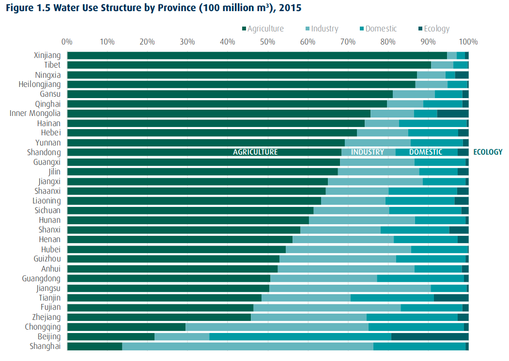

# Discussion

The discourse on water quality should have a more holistic focus which values local knowledge, subjective perspectives and increased awareness to complement the current primary focus on direct water quality. 

## Issues and Implications

China has made a range of commitments, and notable action, on improving the country's water quality. The government invested 717.6b RMB (US\$110.3b) to address water quality, quantity and flooding issues in 2017 alone. [@theworldbankWatershedNewEra2019, p.. vii]. The priority improvement method is infrastructure development – Since the founding of the P.R.C., over 800 billion cubic meters of water storage has been constructed though over 400 thousand kilometers of river dikes and over 98000 reservoirs. [@theworldbankWatershedNewEra2019, p. 2] Additionally, nearly 6000 water supply projects provide rural services to more than 800 million people. 

The *Three Red Lines* policy best states the central government's aims to address water resources issues: [@theworldbankWatershedNewEra2019, box. 1.2]

- *Water quantity*: By 2030, total water use must not exceed 700 billion cubic meters.
- *Water use efficiency*: By 2030, industries will reduce their water use per US$1600 (RMB 10,000) of industrial added value to 40 cubic meters. In addition, by 2030, irrigation efficiency must exceed 60 percent.
- *Water quality*: By 2030, 95 percent of water function zones must comply with water quality standards. In addition, by 2030 all sources of drinking water will meet set standards for both rural and urban areas and all water function zones will comply with water quality standards

Progress is being made towards Sustainable Development Goals 6 – Clean Water and Sanitation. However, China still has substantial improvements to make: for example, water stress is high and expected to increase (SDG 6.4.2), and household wastewater treatment is low (SDG 6.3.1 - 38%). [@CountryAreaSDG] 

SDG 6.3 focuses on water quality:

> By 2030, improve water quality by reducing pollution, eliminating dumping and minimizing release of hazardous chemicals and materials, halving the proportion of untreated wastewater and substantially increasing recycling and safe reuse globally. [@martinWaterSanitation] #check-source

Another key component to China's water policy is its efficiency. SDG 6.4 focuses on this:

> By 2030, substantially increase water-use efficiency across all sectors and ensure sustainable withdrawals and supply of freshwater to address water scarcity and substantially reduce the number of people suffering from water scarcity. [@martinWaterSanitation] #check-source

China is currently far from achieving this target. A recent study found that not only does China have a significant lack of resource efficiency, there are also significant discrepancies between provinces and across time frames. [@songWaterResourcesUtilization2018] This indicates the situation is local, and a homogeneous national-level solution may not be appropriate. Currently, China spends two to three times more than the average upper-middle-income country for the same economic output.[^1] [@theworldbankWatershedNewEra2019, p. 2] Furthermore, while agricultural and industrial water use has remained relatively constant in recent years, domestic use has and continues to increase.

#todo **Find data, make my own chart** [@theworldbankWatershedNewEra2019, p. 22]

The two main driving forces for economic growth with relation to water resources are quantity and utilization. [@chen2017way] Since current technology all but prohibits increasing the overall quantity, the main method of achieving economic growth is to increase the quantity of usable water (by increasing quality) and decreasing inefficiency.

The issues highlighted above lead to increased pressure and deterioration of ecosystem services. Natural ecological systems are decreasing in size, quality, and utility to provide benefits for the society – wetlands and riverbanks are decreasing in their ability to provide flood protection, and wetlands are less able to retain water. [@theworldbankWatershedNewEra2019, p. 3] Furthermore, biodiversity has declined significantly. This is at direct odds with China's plan to become an 'ecological civilization', as highlighted in their 13th Five-Year Plan (2016-2020).

Another notable policy implication is China's energy profile. Coal usage is more prevalent in the north, were water resources are less abundant. Since large quantities of water are required for fossil fuel production and use (roughly six cubic meters per ton of coal and roughly ten cubic meters per ton of oil), diminishing water resources have the potential to strain energy production. [@theworldbankWatershedNewEra2019, p. 3]

Many of these issues are exacerbated by policy coordination problems. While national standards have been discussed in this thesis, water resource management often is in the purview of local and provincial officials. [@theworldbankWatershedNewEra2019, p. 4] Water Resource Bureaus exist at all levels of administrative regions, from townships to provincial levels).

## A Multi-Stakeholder, Multi-Scale Approach

This all leads to the conclusion that top-down, Beijing-lead infrastructure programs are not enough to meet many of the SDG 6 targets and indicators. #cite

Engineering as a broader profession can be looked at through an ethical lens. Engineers, and engineering, should not be the end solution, they should be seen as a provider of a service in order to facilitate improvement through informed consent and participation. [@tafth.broomejrETHICSSlipperyEthics1986] states the issue eloquently:

> “\[E\]ngineering is always an experiment involving the public as human subjects. This new view suggests that engineering always oversteps the limits of science. Decisions are always made with insufficient information. In this view, risks taken by people who depend on engineers are not really the risks over some error of scientific principle. More important and inevitable is the risk that the engineer, confronted with a totally novel technological problem, will incorrectly intuit which precedent that worked in the past can be successfully applied this time. \[...\] Interestingly these new moral dimensions are not being created primarily by philosophers. They are the works of engineers themselves.”

Inclusion of local knowledge and expertise can reduce the impacts of this issue. The less-discussed SDG 6.B mentions this:

> Support and strengthen the participation of local communities in improving water and sanitation management. [@martinWaterSanitation] #check-source

While data is limited, China had low participation from users and communities for drinking water, sanitation and hygiene promotion in both rural and urban areas, and only had moderate participation for national water resources planning and management in 2017. [@CountryAreaSDG] This seems to have improved with urban and rural drinking water, with high and moderate levels of participation in 2019, respectively.

Other sectors are also not very involved, due to poor economic policy instruments which do no properly incentivize innovative and sustainable water use. [@theworldbankWatershedNewEra2019, p. 7] Improvements in the pricing and accountability of water usage in both abject quantities and inter-agency knowledge sharing would improve the situation from a policy perspective.

The central government has an opportunity to increase local autonomy by playing a coordinating and supporting role. Beijing should continue to set standards and provide funding, but allow local administrators to adapt their implementation. This will have an improvement on regions with low-efficiency of water usage through cross-regional cooperation and communication. [@zhaoInterprovincialTwostageWater2017, sec. 4] Regional governments should prioritize water protection, domestic water usage and industrial motivations, as well as coordinate to reduce discrepancies in efficiency between urban and rural areas (urban areas are usually more efficient). [@zhaoInterprovincialTwostageWater2017, sec. 4]

[@priscoliWhatPublicParticipation2004] examined public participation in water resources management, and identified five areas of concern. Additional context has been added to points of relevance by the author.

1. Ethical dimensions of water management.

> Access to safely managed water and sanitation services is a human right, which provides dignity. [@assembly2010resolution] This includes availability, quality, accessibility, affordability and safety. [@hellerCrisisWaterSupply2015] 

2. Water management and civic culture.

> "Civic responsibility is enhanced when citizens meaningfully participate in making decisions that affect their lives." [@priscoliWhatPublicParticipation2004, p. 223] When water, civic culture and governance come together, knowledge transfer and empowerment occurs. While this phenomenon is not new ([@priscoliWhatPublicParticipation2004] cites the fountains in the public squares of many European cities), it is being lost as technical solutions become outside of the understanding of the average resident.

3. Tension between the technical and political.

> As discussed previously, technical innovation is important for improving the water quality situation in China. However, in many societies, the technical and political realms operate separately and sometimes at odds with one another. It is important for policymakers to understand some of the technology they are legislating on, as well as for technical professionals to understand the policy mechanism and context.

4. Reconciling the discontinuities between geographic and jurisdictional boundaries.

> This ties in with knowledge transfer and local realities, as mentioned previously. Since participation is ultimately a locally-led phenomenon, it is important to coordinate between localities effectively.

5. Need for better and more conflict management.

> As water resources become more stressed under the pressure of more demanding users, having knowledgeable and skilled professionals and effective systems to mitigate conflict is vital.

With many of these points, knowledge and education can be the facilitators of positive improvements in the causes and effects of water resources issues.

## Education

In addition to policy changes, education-focused policies should be implemented to directly and indirectly improve China's water situation through knowledge and perception acquisition pathways.

First, water and environmental education should be expanded in scope and scale in China's 9-year compulsory education. A study investigated the relationship between water conservation behavior and water education in Guangzhou, China though a survey ($n=237$) – they found that additional education will result in improved behavior regarding water conservation, through both awareness improvement and personal behavior change. [@xiongRelationshipWaterconservationBehavior2016] At least in Guangzhou, a first-tier city with above-average economic status, the authors found that water-conservation education was extremely rare, accounting for only 0.2–1.4% of the curriculum and included in only four compulsory courses throughout the nine-year compulsory education program. The study found that most students agreed with the premise that water conservation is necessary, but failed to change behavior to address the problem. Further, the least frequent source of water conservation knowledge sources were government activities (10%), indicating a lack of direct knowledge transfer from the current water resources management policymakers. [@xiongRelationshipWaterconservationBehavior2016, fig. 4]

Similar conclusions could be made with regard to water quality, as it plays a role in water conservation strategies. While another study failed to link higher education levels with water resource efficiency, the authors noted that the lack of this correlation was due to the current weak state of water resource education in the Chinese education system, especially in early phases of education. [@songWaterResourcesUtilization2018, sec. 5.2] This is in contrast with the authors' findings of technological innovation's effect on water resource efficiency — this effect was significant in some but not all parts of the country, further indicating that heterogeneous strategies could prove more effective than homogeneous ones.

In regards to expanding general environmental and water resource education, specific components of water scarcity, water quality, measurement, sources and implications should all be taught. The national government has a very clear, easy-to-understand water quality index, but the thesis analysis reveals that this is not well comprehended by the general public. This should be explicitly taught with a focus on its importance — summarizing many complex indicators into one composite value which is easy to understand, compare and evaluate. Further, education water quality and its implications to many facets of life (as discussed in this thesis) should be expanded. So to should non-lecture-based education. The knowledge and implications should be localized as much as possible, with local experts, field trips, and other experiential learning techniques.

One tool should be a water information sharing platform which is accessible to both the general public and water stakeholders. [@theworldbankWatershedNewEra2019, p. 10] For water stakeholders, open data on water quantity, quality, pricing, and utilization can improve the overall water resources management sector. For individuals, access to information about their local, regional and national information on water quantity, quality, pricing, and utilization can improve water awareness, perception and knowledge. It also has the potential to align water quality with perceptions, which can improve political support if positive.

## Conclusion

Water quality and its grave implications for human, economic and political security have been explored at length. This thesis adds the human perception component to the discussion.

The analysis highlights two categories of how water quality perception and knowledge. The first is through education, correlates positively with perception and knowledge traits. Specifically, more educated individuals perceive the impact of water quality to be greater and more harmful than less educated individuals. Also, education in general related positively with knowledge about water quality specifically. The second is though the condition of regional water quality. Perceived severity increases in areas with worse water quality. So to does knowledge about water quality.

Thus, a multifaceted policy approach should be undertaken. This should continue to make infrastructural improvements in water quality, but also make improvements in the education, societal and communication portions of water quality and water resource management. Making the general populous more aware and more engaged in the water pollution discourse can cause improvements in which infrastructure solutions alone can not. With increased trends in urban and domestic water usage, having an informed populous is key to abating water pollution, scarcity and availability issues. 

Finally, more research should be undertaken which better models knowledge acquisition pathways for water quality, multivariable analysis on how the variables mentioned in this thesis interact with one another, and quantitative predictions of the impact that non-infrastructure policy would have. With such a serious threat to China and the world, all types of solutions should be considered and implemented.

China has an opportunity to transition from an under-performing water resource actor to one which leads and innovates in multisectoral policy solutions. This will not only cause improvements to various health and economic metrics, but also create a more knowledgeable, engaged, sustainable and satisfied civilization. 

## References

[^1]: This is a measurement to compare how much water is used to achieve a set amount of added value in the industrial sector. "China’s water consumption per RMB 10,000 (roughly US$1,450) industrial added value is two to three times greater than the average upper-middle-income country (UMIC)."