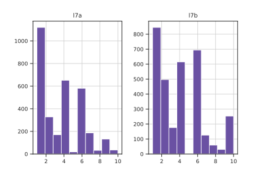
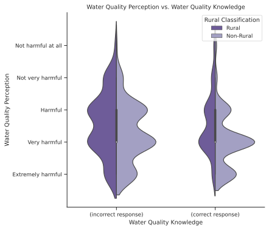
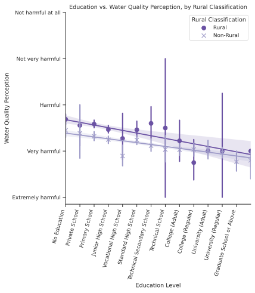

# Analysis
## Results

The following is a summary of the results of the analysis. The code and procedure can be referred to in the #appendix section.

Overall, respondents are self-report a fairly high level of concern regarding environmental issues, and a high level of awareness for environmental issues facing China. [^1]

| Response Value | l6a                                    | l6b                             |
|---------------:|:--------------------------------------:|:-------------------------------:|
|              1 | I don't care at all                    | Very serious                    |
|              2 | Less caring                            | More serious                    |
|              3 | I can't say that I don't care about it | Neither serious nor not serious |
|              4 | More concerned                         | Not too serious                 |
|              5 | Very concerned                         | Not serious at all              |

For `l6a` and `l6b` ($n=3362$) the mean response was 3.67 and 2.15 respectively, noting the structure of the data –  an increase in `l6a` notes an increase in concern while a decrease in `l6b` notes an increase in awareness. The distribution of responses is the following:

The trend is consistent across most provinces, water quality, gender, education levels, age groups, and rural classification. #todo **Insert plots for these controls**

Concern of water pollution ranked high on respondents' overall environmental concerns. Respondents ranked their most ($n=3218$) and second-most ($n=3045$) important environmental issues in China. Water pollution was the second most common response for their most important environmental concern, behind air pollution and ahead of domestic waste disposal. Water scarcity ranked lower. For respondents' second most concern, water pollution was the third most common response, behind domestic waste disposal and ahead of fertilizer and pesticide pollution.

| Code | Name                               |
|-----:|:-----------------------------------|
|    1 | Air Pollution                      |
|    2 | Fertilizer and pesticide pollution |
|    3 | Water scarcity                     |
|    4 | Water pollution                    |
|    5 | Nuclear waste                      |
|    6 | Disposal of domestic waste         |
|    7 | Climate Change                     |
|    8 | Genetically modified food          |
|    9 | Depletion of natural resources     |
|   10 | None of the above                  |

 #todo **Label histogram, find a way to do this in Seaborn**
 
 For the following hypotheses, it is important to remember the question types and response ranges. As the level of perceived harm increases for `l14d`, the value decreases. As responses approaches 2 for `l2409`, the knowledge about water quality issues is assumed to increase. While this is as set of binary responses, it is calculated as a mean later in this analysis.
 
|         Code: | `l14d` (perception)                                                                                | `l2409` (knowledge)                                                                                               |
|--------------:|:--------------------------------------------------------------------------------------------------:|:-----------------------------------------------------------------------------------------------------------------:|
| **Question**: | How do you think the pollution of rivers, rivers and lakes in China is harmful to the environment? | In the domestic water pollution report, the water quality of Category V (5) is better than that of Category I (1) |
|             1 | Extremely harmful to the environment                                                               | Correct                                                                                                           |
|             2 | Very harmful                                                                                       | Error (***note**: this response is correct*)                                                                      |
|             3 | Some hazards                                                                                       | -                                                                                                                 |
|             4 | Not very harmful                                                                                   | -                                                                                                                 |
|             5 | There is no harm at all                                                                            | -                                                                                                                 |

### Hypothesis 1: Worse local (provincial) water quality (`score` increases) relates to an increased perception of severity of water quality issues (`l14d` decreases)

There is a statistically significant ($p=4.98 \text{e-}9$) correlation with a large number of responses ($n = 3253$). Thus, actual water quality is related to perception of water quality, and worse water quality relates to an increase in perception of severity. However, there is a poor regression fit (coefficient of determination $r=-0.1023$). Note that the range of water quality scores is large when respondents reply with the most-severe perception response type (`l14d`= 5).

### Hypothesis 2 - There is a relationship between water quality and water quality knowledge.

### Hypothesis 3 - An increase knowledge of water quality issues (`l2409`) relates to an increased perception of severity (`l14d`)

There appears to be a relationship between water quality knowledge and perception from the smaller sample size ($n=861$). Respondents who replied incorrectly (when $\text{l2409}=1$) ($n=282$) have a mean perception response $\text{l14d}=2.383$, while respondents who replied correctly (when $\text{l2409}=2$) ($n=579$) have a mean perception response $\text{l14d}=2.197$.

There is a statistically significant ($p= 8.81 \text{e-}4$) correlation, however there is a poor regression fit (coefficient of determination $r=-0.1023$).

With increased water quality knowledge ($\text{l2409}=2$), environmental perception is increased (decreased `l14d`). However, this trend is no longer visible when factoring for rural/urban `a91`, education level `a7a`, and for other demographic question. For more conclusive results, further multi-variable statistical analysis is required.

### Hypothesis 4 - Increased education (`a7a`) relates to more knowledge about water quality (`l2409`)

There seems to be a relation between these two variables. Since `l2409` is analyzed as a binary variable (only two responses), values from each education level are averaged to find the mean.

There is a statistically significant ($p= 1 \text{e-}6$) correlation, however there is a poor regression fit ($r=-0.16$) with a smaller sample size $n=881$. Further comparison with rural versus non-rural responses reveal large differences in both the typical level of education and the number of responses per rural classifier.

### Hypothesis 5 - Increased education (`a7a`) relates to an increased perception of severity (`l14d`):

There is a clear trend between education and perception, with a larger sample size ($n=3252$). There is a statistically significant correlation ($p \approx 0$). There is a fairly low regression fit ($r=-0.2109$).

When differentiated by rural classification, an interesting trend becomes evident: non-rural households have a higher perception than rural households at each education level, however this difference decreases as education increases. Analysis into the reason behind this was not conducted.

### Hypothesis 6 - There is a significant difference in perception of severity of water quality issues (`l14d`) between urban and rural households (`a91`).

With a larger sample size ($n=3252$), a statistically-significant difference was found ($p \approx 0$). There is a fairly low regression fit ($r=-0.2018$) The mean `l14d` value per rural classification was calculated. However, education levels vary significantly between rural and non-rural respondents.

| Rural Classification | Number of Responses | Mean Perception (l14d) | Mean Education Level (a7a) |
|:--------------------:|:-------------------:|:----------------------:|:--------------------------:|
| Rural (a91 = 1)      | 1257                | 2.536                  | 3.48                       |
| Non-rural (a91 = 2)  | 1995                | 2.172                  | 6.24                       |

## Findings

The analysis above produced interesting results. Overall, all five hypotheses were proven correct, with the limitation that all regression analyses provide a poor fit to model these trends. This can be explained that there are variable(s) which are contributing to this trend which are not accounted for in the simple two-variable regression analysis. Another interpretation could be that there factors influencing these correlations which are not accounted for in the data sets analyzed for this thesis. Further analysis is required to explain the causes of this poor fit. The limitations discussed previously, including geographic precision, differences in periods of time and applicability of the analyzed questions, should also be noted. Given more data, specifically updated CGSS results when the environmental module is included, would give the opportunity to conduct a longitudinal analysis.

[^1]: `l6a` asks "Generally speaking, how much do you care about environmental issues?" and `l6b` asks "Based on your own judgment, on the whole, do you think the environmental problems facing China are serious?"